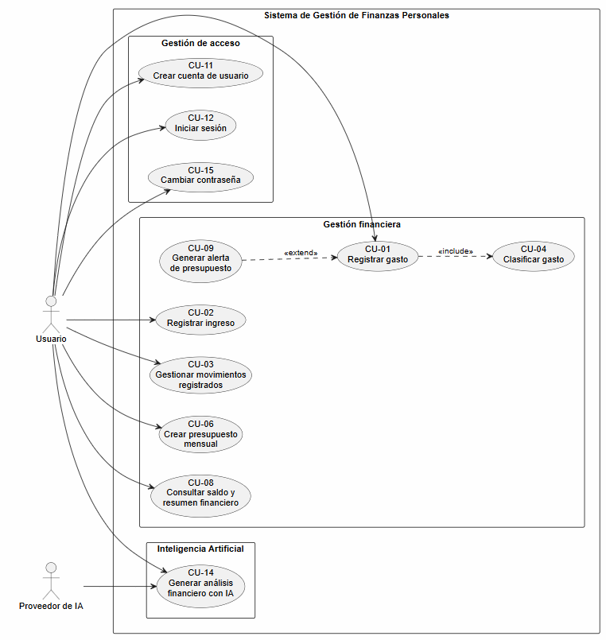

# Taller 4 · Casos de uso

Se trabaja en clase, por equipo.

- **Entrega:** en el **repositorio del equipo en GitHub**, diligenciando el enunciado con los puntos 1 a 5 y subiendo el diagrama al repositorio _(imagen exportada o fuente PlantUML/draw.io)_.
- Herramienta: draw.io, PlantUML, StarUML o Visual Paradigm.

---

## 1. Actores y casos

**Actores**

| Actor             | Tipo _(humano / sistema externo / tiempo)_ | Principal o secundario | Objetivo en el sistema                                                                                                                       |
| ----------------- | ------------------------------------------ | ---------------------- | -------------------------------------------------------------------------------------------------------------------------------------------- |
| _(usuario)_       | _(Humano)_                                 | _(Principal)_          | _(Gestionar sus ingresos, gastos y presupuesto personal)_                                                                                    |
| _(Administrador)_ | _(Humano)_                                 | _(Principal)_          | _(Desarrollar nuevas funcionalidades y correcion de errores)_                                                                                |
| _(Sistema IA)_    | _(Sistema externo)_                        | _(Secundario)_         | _(Procesar la información enviada por el sistema para generar análisis y recomendaciones generales sobre los hábitos de gasto del usuario.)_ |

- Roles, no personas. La base de datos y el servidor **no** son actores.
- Si el proyecto tiene componente de IA, el **proveedor del modelo** es un actor secundario.

**Casos de uso**

| ID    | Nombre _(verbo en infinitivo + objeto)_ | Actor principal | RF que cubre |
| ----- | --------------------------------------- | --------------- | ------------ |
| CU-01 | _(Registrar gastos)_                    | _(Usuario)_     | _(RF-01)_    |
| CU-02 | _(Registrar ingresos)_                  | _(Usario)_      | _(RF-02)_    |
| CU-03 | _(Modificar movimiento financiero)_     | _(Usuario)_     | _(RF-03)_    |
| CU-04 | _(Eliminar movimiento financiero)_      | _(Usuario)_     | _(RF-04)_    |
| CU-05 | _(Clasificar gasto)_                    | _(Usuario)_     | _(RF-05)_    |
| CU-06 | _(Consultar historial de movimientos)_  | _(Usuario)_     | _(RF-06)_    |
| CU-07 | _(Consultar total gastado)_             | _(Usuario)_     | _(RF-07)_    |
| CU-08 | _(Calcular saldo disponible)_           | _(Usuario)_     | _(RF-08)_    |
| CU-09 | _(Crear presupuesto mensual)_           | _(Usuario)_     | _(RF-09)_    |
| CU-10 | _(Consultar alerta de presupuesto)_     | _(Usuario)_     | _(RF-10)_    |
| CU-11 | _(Crear cuenta de usuario)_             | _(Usuario)_     | _(RF-11)_    |
| CU-12 | _(Iniciar sesión)_                      | _(Usuario)_     | _(RF-12)_    |
| CU-13 | _(Visualizar estadísticas de gastos)_   | _(Usuario)_     | _(RF-13)_    |
| CU-14 | _(Generar análisis financiero con IA)_  | _(Usuario)_     | _(RF-14)_    |
| CU-15 | _(Cambiar contraseña)_                  | _(Usuario)_     | _(RF-15)_    |
| …     |                                         |                 |              |

- **Mínimo 6 casos**, todos con al menos un RF.

---

## 2. Diagrama de casos de uso

Un solo diagrama con:

- **Límite del sistema** con su nombre; los casos dentro, los actores fuera.
- Todos los casos del punto 1 y sus asociaciones con los actores.
- Al menos una relación **`«include»`, `«extend»` o generalización**, justificada en una línea. Si el dominio no pide ninguna, se escribe por qué.

**Imagen o enlace al diagrama:**

**Justificación de las relaciones:**

- \_(**CU-01 Registrar gasto `«include»` CU-04 Clasificar gasto:**  
  Se utiliza `«include»` porque al registrar un gasto este debe quedar asociado a una categoría, por lo que la clasificación forma parte necesaria del proceso de registro.

- **CU-09 Generar alerta de presupuesto `«extend»` CU-01 Registrar gasto:**  
  Se utiliza `«extend»` porque la alerta no se genera en todos los registros de gastos; únicamente se activa cuando el gasto registrado hace que el usuario se acerque o supere el límite del presupuesto establecido.)\_

---

## 3. Casos críticos

Los tres casos que el prototipo implementa **de punta a punta** _(de la interfaz a la persistencia)_.

| Caso                                         | Por qué es crítico _(valor / frecuencia / riesgo técnico)_                                                                                                                                                                         |
| -------------------------------------------- | ---------------------------------------------------------------------------------------------------------------------------------------------------------------------------------------------------------------------------------- |
| _(CU-01 Registrar gasto)_                    | _(Es una de las funciones principales del sistema y será utilizada con frecuencia. Permite almacenar la información necesaria para el control financiero y alimenta otras funciones como categorías, presupuesto y estadísticas.)_ |
| _(CU-06 Crear presupuesto mensual)_          | _(Es importante porque permite establecer un límite de gasto para el usuario y sirve como base para determinar cuándo deben generarse alertas relacionadas con el presupuesto.)_                                                   |
| _(CU-14 Generar análisis financiero con IA)_ | _(Es el componente de inteligencia artificial del proyecto. Tiene mayor riesgo técnico porque depende de un proveedor externo y debe manejar situaciones como falta de respuesta, límite de cuota o respuestas inválidas.)_        |

- **Máximo uno** puede ser el caso de IA; los otros dos son funcionalidad con persistencia propia.
- No valen iniciar sesión.

---

## 4. Descripción detallada de los casos críticos

Tabla 1

| Campo                    | Contenido                                                                                                                          |
| ------------------------ | ---------------------------------------------------------------------------------------------------------------------------------- |
| **ID y nombre**          | _(CU-01 Registrar gasto)_                                                                                                          |
| **Actor principal**      | _(Usuario)_                                                                                                                        |
| **Actores secundarios**  | _(—)_                                                                                                                              |
| **Requisitos que cubre** | _(RF-01, RNF-01, RNF-05)_                                                                                                          |
| **Precondiciones**       | _(El usuario debe tener una cuenta registrada y haber iniciado sesión.)_                                                           |
| **Disparador**           | _(El usuario desea registrar un gasto realizado.)_                                                                                 |
| **Frecuencia**           | _(Cada vez que el usuario necesite registrar un gasto. La cantidad exacta de registros depende de la información obtenida en P7.)_ |

**Flujo principal**

1. _(El usuario solicita registrar un nuevo gasto.)_
2. _(El sistema solicita la información correspondiente al gasto.)_
3. _(El usuario proporciona el valor, fecha, categoría y demás información requerida.)_
4. _(El sistema valida que los datos obligatorios estén completos y sean válidos.)_
5. _(El sistema clasifica el gasto en la categoría seleccionada.)_
6. _(El sistema almacena el gasto asociado a la cuenta del usuario.)_
7. _(El sistema actualiza los totales y el saldo disponible.)_
8. _(El sistema confirma al usuario que el gasto fue registrado correctamente.)_

**Flujos alternos** _(se logra el objetivo por otro camino)_

- **4a.** _(Si el usuario detecta un dato incorrecto antes de confirmar el registro, modifica la información y el proceso vuelve al paso 4.)_

**Excepciones** _(no se logra el objetivo)_

- **4b.** _(Si falta información obligatoria o algún dato tiene un formato inválido, el sistema informa qué información debe corregirse y no almacena el gasto. El caso termina sin realizar cambios.)_

**Postcondiciones**

- **Éxito:** _(El gasto queda almacenado correctamente y asociado a la cuenta del usuario.)_
- **Garantía mínima:** _(Si el registro no puede completarse, no se almacena información incompleta o inconsistente.)_

Tabla 2

| Campo                    | Contenido                                                                             |
| ------------------------ | ------------------------------------------------------------------------------------- |
| **ID y nombre**          | _(CU-06 Crear presupuesto mensual)_                                                   |
| **Actor principal**      | _(Usuario)_                                                                           |
| **Actores secundarios**  | _(—)_                                                                                 |
| **Requisitos que cubre** | _(RF-09, RNF-01, RNF-04)_                                                             |
| **Precondiciones**       | _(El usuario debe tener una cuenta registrada y haber iniciado sesión.)_              |
| **Disparador**           | _(El usuario desea establecer un límite de gasto para el mes.)_                       |
| **Frecuencia**           | _(Normalmente una vez al mes o cuando el usuario necesite modificar su presupuesto.)_ |

**Flujo principal**

1. _(El usuario solicita crear un presupuesto mensual.)_
2. _(El sistema solicita el valor del presupuesto.)_
3. _(El usuario ingresa el valor que desea utilizar como límite mensual.)_
4. _(El sistema valida que el valor ingresado sea válido y mayor que cero.)_
5. _(El sistema almacena el presupuesto asociado al usuario y al periodo correspondiente.)_
6. _(El sistema utiliza el presupuesto como referencia para comparar los gastos registrados.)_
7. _(El sistema confirma que el presupuesto mensual fue creado correctamente.)_

**Flujos alternos** _(se logra el objetivo por otro camino)_

- **3a.** _(Si el usuario ya tiene un presupuesto registrado para el mes, el sistema informa su existencia y permite reemplazarlo por un nuevo valor. El proceso continúa desde el paso 4.)_

**Excepciones** _(no se logra el objetivo)_

- **4a.** _(Si el usuario ingresa un valor vacío, igual a cero, negativo o inválido, el sistema informa el error y no almacena el presupuesto. El caso termina sin modificar la información existente.)_

**Postcondiciones**

- **Éxito:** _(El presupuesto mensual queda almacenado y disponible para comparar los gastos registrados.)_
- **Garantía mínima:** _(Si la operación falla, el presupuesto anterior, si existe, permanece sin cambios.)_

Tabla 3

| Campo                    | Contenido                                                                                      |
| ------------------------ | ---------------------------------------------------------------------------------------------- |
| **ID y nombre**          | _(CU-14 Generar análisis financiero con IA)_                                                   |
| **Actor principal**      | _(Usuario)_                                                                                    |
| **Actores secundarios**  | _(Sistema IA)_                                                                                 |
| **Requisitos que cubre** | _(RF-14, RNF-06)_                                                                              |
| **Precondiciones**       | _(El usuario debe haber iniciado sesión y debe tener movimientos financieros registrados.)_    |
| **Disparador**           | _(El usuario solicita analizar sus movimientos financieros mediante inteligencia artificial.)_ |
| **Frecuencia**           | _(Bajo demanda, cada vez que el usuario solicite un nuevo análisis.)_                          |

**Flujo principal**

1. _(El usuario solicita generar un análisis de sus movimientos financieros.)_
2. _(El sistema consulta los ingresos, gastos, categorías y presupuesto asociados al usuario.)_
3. _(El sistema prepara únicamente la información necesaria para realizar el análisis.)_
4. _(El sistema envía la información preparada al sistema de IA.)_
5. _(El sistema de IA procesa los datos y devuelve una respuesta al sistema.)_
6. _(El sistema valida que la respuesta tenga un formato válido y contenga información relacionada con los movimientos analizados.)_
7. _(El sistema muestra al usuario patrones de gasto y recomendaciones generales para mejorar el control de su presupuesto.)_
8. _(El usuario consulta el análisis generado.)_

**Flujos alternos** _(se logra el objetivo por otro camino)_

- **2a.** _(Si el usuario tiene pocos movimientos registrados, el sistema informa que el análisis se realizará con la información disponible y continúa desde el paso 3.)_

**Excepciones** _(no se logra el objetivo)_

- **4a. Timeout:** _(Si el proveedor de IA no responde dentro del tiempo establecido, el sistema informa que el servicio no está disponible temporalmente. El caso termina sin modificar los datos financieros.)_
- **4b. Cuota agotada** _(Si el proveedor informa que se alcanzó el límite de solicitudes disponible, el sistema informa al usuario que el análisis no puede realizarse en ese momento. El caso termina sin modificar los datos financieros.)_
- **5a. Respuesta malformada:** _(Si el proveedor devuelve una respuesta vacía, inválida o que no cumple el formato esperado, el sistema descarta la respuesta, informa que no fue posible generar el análisis y finaliza el caso.)_

**Postcondiciones**

- **Éxito:** _(El usuario recibe un análisis de sus movimientos financieros con patrones de gasto y recomendaciones generales.)_
- **Garantía mínima:** _(Ninguna falla del proveedor de IA modifica o elimina los ingresos, gastos, presupuesto o demás información financiera almacenada.)_

---

## 5. Trazabilidad

**Columna de caso de uso de la matriz** _(la que se abrió en la Clase 3)_:

| Requisito                                      | Fuente       | Caso de uso                                    |
| ---------------------------------------------- | ------------ | ---------------------------------------------- |
| RF-01 Registrar gastos                         | _(P3)_       | _(CU-01 Registrar gasto)_                      |
| RF-02 Registrar ingresos                       | _(P3)_       | _(CU-02 Registrar ingreso)_                    |
| RF-03 Modificar ingresos y gastos registrados  | _(P5, P9)_   | _(CU-03 Gestionar movimientos registrados)_    |
| RF-04 Eliminar ingresos y gastos registrados   | _(P5, P9)_   | _(CU-03 Gestionar movimientos registrados)_    |
| RF-05 Clasificar gastos por categorías         | _(P3, P4)_   | _(CU-04 Clasificar gasto)_                     |
| RF-06 Consultar historial de ingresos y gastos | _(P4)_       | _(CU-03 Gestionar movimientos registrados)_    |
| RF-07 Consultar el total gastado               | _(P4)_       | _(CU-08 Consultar saldo y resumen financiero)_ |
| RF-08 Calcular y mostrar el saldo disponible   | _(P1, P4)_   | _(CU-08 Consultar saldo y resumen financiero)_ |
| RF-09 Crear un presupuesto mensual             | _(P10)_      | _(CU-06 Crear presupuesto mensual)_            |
| RF-10 Generar alertas de presupuesto           | _(P10, P11)_ | _(CU-09 Generar alerta de presupuesto)_        |
| RF-11 Crear una cuenta de usuario              | _(P13)_      | _(CU-11 Crear cuenta de usuario)_              |
| RF-12 Autenticarse en el sistema               | _(P9, P13)_  | _(CU-12 Iniciar sesión)_                       |
| RF-13 Visualizar estadísticas de gastos        | _(P4)_       | _(CU-08 Consultar saldo y resumen financiero)_ |
| RF-14 Generar análisis financiero con IA       | _(P15)_      | _(CU-14 Generar análisis financiero con IA)_   |
| RF-15 Cambiar contraseña                       | _(P13)_      | _(CU-15 Cambiar contraseña)_                   |
| …                                              |              |                                                |

**Huecos detectados:**

| Hueco              | Cuál                      | Qué se hace                                    |
| ------------------ | ------------------------- | ---------------------------------------------- |
| RF sin caso de uso | _(Ninguno)_ | _(Todos los requisitos funcionales están asociados a por lo menos un caso de uso.)_  |
| Caso de uso sin RF | _(Ninguno)_ | _(Todos los casos de uso definidos están respaldados por uno o más requisitos funcionales.)_ |

- Todo lo que cambie el catálogo va al **registro de control de cambios** de la bitácora.

---

## Ejemplo diligenciado

Referencia de nivel de detalle. Mismo dominio de los talleres anteriores: **no se puede usar.**

**1. Actores** _(barbería; extracto)_

| Actor           | Tipo                         | Principal o secundario | Objetivo                                         |
| --------------- | ---------------------------- | ---------------------- | ------------------------------------------------ |
| Cliente         | Humano                       | Principal              | Conseguir un turno sin llamar                    |
| Barbero         | Humano                       | Principal              | Saber a quién atiende y registrar quién no llegó |
| Dueño           | Humano _(hereda de Barbero)_ | Principal              | Cerrar caja y mantener la clientela              |
| Proveedor de IA | Sistema externo              | Secundario             | Redactar el texto del recordatorio               |

**1. Casos** _(extracto)_

| ID    | Nombre                       | Actor principal | RF    |
| ----- | ---------------------------- | --------------- | ----- |
| CU-01 | Reservar turno               | Cliente         | RF-01 |
| CU-02 | Consultar franjas libres     | Cliente         | RF-01 |
| CU-03 | Cancelar turno               | Cliente         | RF-04 |
| CU-05 | Marcar turno no asistido     | Barbero         | RF-02 |
| CU-06 | Cerrar caja del día          | Dueño           | RF-05 |
| CU-07 | Redactar recordatorio con IA | Dueño           | RF-08 |

**2. Relaciones:** CU-01 `«include»` CU-02, porque toda reserva pasa por consultar las franjas y el cliente también las consulta sin reservar. Dueño hereda de Barbero, porque el dueño también atiende una silla.

**3. Críticos**

| Caso                               | Por qué                                                                                                                |
| ---------------------------------- | ---------------------------------------------------------------------------------------------------------------------- |
| CU-01 Reservar turno               | Es el problema que se tiene es: el teléfono no para los sábados; ~40 al día; riesgo de dos reservas en la misma franja |
| CU-06 Cerrar caja del día          | Todos los días; cálculo sobre los turnos atendidos                                                                     |
| CU-07 Redactar recordatorio con IA | El caso de IA; reduce los no asistidos _(P6)_                                                                          |

**4. Descripción** _(CU-07; CU-01 está completo en la Sesión 5)_

| Campo                   | Contenido                                            |
| ----------------------- | ---------------------------------------------------- |
| **Actor principal**     | Dueño                                                |
| **Actores secundarios** | Proveedor de IA                                      |
| **Requisitos**          | RF-08, RNF-04 _(respuesta en menos de 10 s)_         |
| **Precondiciones**      | Hay turnos _Reservados_ para el día siguiente        |
| **Disparador**          | El dueño prepara los recordatorios al cierre del día |
| **Frecuencia**          | Una vez al día                                       |

1. El dueño pide los recordatorios del día siguiente.
2. El sistema lista los turnos _Reservados_ de mañana.
3. El sistema envía al proveedor de IA la franja, el barbero y el nombre de pila de cada cliente, **sin teléfono**.
4. El proveedor devuelve un borrador de mensaje por turno.
5. El sistema valida que cada borrador traiga fecha y franja, y los muestra marcados como _texto generado_.
6. El dueño revisa, edita si quiere y aprueba.
7. El sistema guarda los mensajes aprobados listos para enviar.

- **5a.** Un borrador no trae fecha o franja: se descarta y se usa la plantilla fija para ese turno. Vuelve al paso 6.
- **6a.** El dueño descarta un borrador: el sistema usa la plantilla fija para ese turno. Vuelve al paso 6.
- **4a.** _(excepción)_ El proveedor no responde en 10 s o devuelve HTTP 429: el sistema informa que la IA no está disponible, registra el evento y ofrece la plantilla fija para todos. El caso termina sin texto generado.

**Postcondiciones.** Éxito: cada turno de mañana tiene un mensaje aprobado. Garantía mínima: ningún dato de contacto sale hacia el proveedor.

**5. Huecos:** RF-06 _(reporte mensual de ingresos)_ sin caso → se crea CU-09 Consultar reporte mensual. CU-04 Avisar a la lista de espera sin RF → se agrega RF-11 y se registra en el control de cambios.
